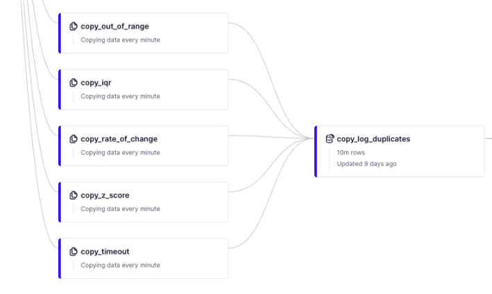

# Using Copy Pipes to log anomalies

To start this discussion, let's describe what [Copy Pipes](https://www.tinybird.co/docs/publish/copy-pipes.html#copy-pipes) are. In any Pipe, a single Node can be selected to make a copy of its results and write them into a Data Source. This *Copy Pipe* process can be triggered on demand, or on a selected interval. 

### Considering the number of endpoints to report on all anomaly types

As part of this project, we have five API Endpoints that scan for and return anomalies, one for each anomaly type. These endpoints provide flexible ways to detect anomalies in real-time time-series data. 

These endpoints make it possible to detect anomalies in streamed and event data with little latency. Most of the queries shared as part of this project take only milliseconds to return results. 

Collectively, they support query parameters for selecting sensors of interest, setting time windows for scanning data and for developing statistics for anomaly evaluation, and updating method-specific thresholds and multipliers. 

The drawback of having five separate endpoints is that they all need to be polled to get the most comprehensive view of anomaly detections. If you have a critical anomaly type monitored on a per-minute interval, that is 1,440 requests per day. If each request processes 5 MB of data, that is 7.2 GB of processed data per day. If you want to integrate all five endpoints, that is 7,200 requests and 36 GB of processed data per day. 

Fortunately, it is possible to iterate queries to decrease the amount of data they proess. Already, some of the detection Pipes use very little processed data. For example, the `rate_of_change` and `z_score` Pipes use around 100 KB per call or 144 MB per day when polling every minute. 

While reviewing queries to make them more efficient is a critical step for implementing an anomaly detection system, there is also a fundamental design that can dramatically reduce the number of requests needed to monitor all anomaly types. 

### Can we build a single API Endpoint to return detections for all anomaly types? 

It would be useful to have a single endpoint that shares all detection events across every anomaly type. Instead of five separate endpoints, a single endpoint would require 80% less requests to integrate all types.  

While it is probably possible to chain all Nodes across the five types and come up with a single Pipe and API Endpoint to check for and report on all anomaly types, that sounds like a recipe for comprehension and maintenance disasters. 

Fortunately both Materialized Views and Copy Pipes have the ability to support the model of multiple Pipes writing into a common Data Source. As long as each Pipe generates a common schema, they can write their unique contributions to a shared Data Source. 

Since time window functions are not supported with Materialized Views, and one anomaly recipe was based on window functions (`rate_of_change`), we turned to Copy Pipes to create a Data Source that compiles all detection events into one place. 

## Implementing a common log

### One Copy Pipe per anomaly type 

This project includes five `copy_*` Pipes, one for each anomaly type. These Copy Pipes are updated versions of the Pipes created to provide API Endpoints. They implement the same SQL techiques, including the window functions used by the `rate_of_change` Pipe.

We'll get into the details of the differences between these types of Pipes below. One important difference with Copy Pipe is that there are no incoming API requests with query parameters. Instead, equivalent parameters are configured as constants, and these are applied at every copy interval.  

For example, the `calculate_zscore` Node in the `copy_z_score` Pipe includes these parameters:

```bash
  # A multipler used to determine Z-score outliers. 
  # Statistical quartiles are based on this most recent window.
 # This Pipe makes a copy every minute, so selecting events since last copy plus one minute.  
```
Since the Copy Pipe interval is set to one minute, the `_detect_window_seconds` parameters is set to 61 sesonds to help ensure no detection events are missed between copy triggers in case the timing drifts for some reason. This will likely generate event detection duplicates, which are eliminated with the `dedup_log` Pipe. This Pipe materializes deduplicated values and writes them into the `copy_log` Data Source.  

Each Pipe has an `endpoint` Node that publishes the following schema to the `copy_log_duplicates` Data Source:

* `id` Int16
* `timestamp` DateTime
* `value` Float32
* `anomaly_type` String
* `note` String

Where:

* `anomaly_type` can have these values: interquartile-range, out-of-range, rate-of-change, timeout, and z-score.
* `note` is tailored for each anomaly type. Here is an example for each type:
  
  * interquartile-range: `lower_bound:1286| upper_bound:1509.25`
  * out-of-range: `min:200 max:2000`
  * rate-of-change: `slope:1390.79| max_slope:3| value_diff: 1390.79`
  * timeout: `timestamp is time of last report` 
  * z-score: `2.3355 | high | average: 798.71 | std_dev: 5.38`

Here is what the Copy Pipe data flow looks like:




### Timing and responsiveness considerations

For this project, each Copy Pipe is scheduled to trigger every one minute. The means there will be at least a one minute latency between an anomaly being detected and it being available via an API Endpoint. To view the exact timing of your Copy Pipes, click on the 'View Copy' button and see the 'Metrics' graphs.

The `dedup_log` Pipe performs the deduplication of the `copy_log_duplicates` Data Source by materializing its contents into the `copy_log` Data Source. This step does not add any additional latency when requesting detections from the `copy_log` Data Source. 


### How do these Copy Pipes differ from their API Endpoint Pipe equivalents?

Each Copy Pipe started as a duplicate of its corresponding Pipe used to publish an API Endpoint (e.g. the `copy_z_score` Pipe is based on the `z_score` Pipe). These updates were made to convert them to the Copy Pipe implementation:

* Query parameters were converted to hardcoded parameters in Nodes. 
* The `_detect_window_seconds` parameter was set to the Copy Pipe interval, 60 seconds.
* Each Copy Pipe has a Node that generates output that matches the common Data Source schema.
* Each Copy Pipe constructs a tailored ‘note’ about the anomaly detected. 
* No Copy Pipe provides a LIMIT for the number of detection events selected.  All events detected for the `_detect_window_seconds` are selected. 


