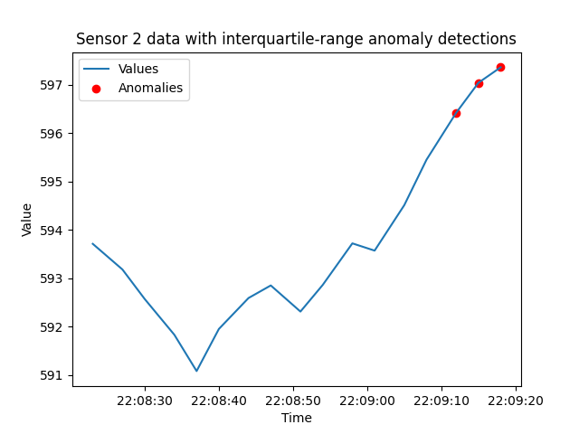

# Interquartile Range (IQR) anomalies

#### Using quartiles to identify anomalies. 

##### Another method of generating data statistics to identify pattern changes, rather than triggering on single or pairs of isolated data points.

[Endpoint documentation](https://api.tinybird.co/endpoint/t_23a80bc263c6453a94d26e2c538dc11a?token=p.eyJ1IjogIjJjOGIyYzQ2LTU4NzYtNGU5Mi1iNGJkLWMwNTliZDFhNzUwZSIsICJpZCI6ICJiZGE0MmIzZi1hOThiLTQwZDMtYmRmZC1jZWVjN2M2NDJlNWIiLCAiaG9zdCI6ICJldV9zaGFyZWQifQ.AGGMjpobLJ7cLArhbBKV8oASZI5ueveivJ4NuEuRHpE)

**Query parameters:**
* **sensor_id** - Used to select a single sensor of interest. Otherwise, returns results for all sensors. 
* **detect_window_seconds** - Defines the time window (in seconds) for selecting data points to examine for anomalies.
* **stats_window_minutes** - Defines the time window (in minutes) for calculating first and third quartiles used to calculate IQR.
* **iqr_multiplier** - The multiplier of the IQR to set the range for testing for IQR anomalies.
* **max_per_sensor** - Used to limit the number of IQR anomalies to return by sensor. 

# Introduction

The Interquartile Range (IQR) method is a valuable tool for identifying anomalies in real-time data by providing a standardized way to compare individual data points to the overall trend of the data. This method is effective for identifying outliers and anomalies in sensor data. When a sensor reading is outside of an IQR-based range, it indicates a deviation from the expected behavior. 

The first step of the Interquartile Range (IQR) method is calculating the first and third quartiles (Q1 and Q3). These quartiles are based on a moving time window of the recent data. 

The difference between these two quartiles is referred to as the IQR, as in:

IQR = Q3 - Q1

Data points that are below or above some level based on a multiplier of this IQR are considered outliers. Commonly, this multiple is set to `1.5`, so we are looking for cases where:

* values < Q1 - (IQR * 1.5) 
* values > Q3 + (IQR * 1.5) 


## Generating a Common Table Expression of statistics

This recipe depends on a Common Table Expression (CTA) for generating statistical quartiles. The following query is an example CTA that calculates first (Q1) and third (Q3) quartiles and calculates a threshold for the last 30 minutes of sensor data. 

```sql
WITH stats AS (
    SELECT id,
        quantileExact(0.25) (value) AS lower_quartile,
        quantileExact(0.75) (value) AS upper_quartile,
        (upper_quartile - lower_quartile) * 1.5 AS IQR
    FROM incoming_data
    WHERE timestamp BETWEEN (NOW() - INTERVAL 30 MINUTE) AND NOW()
    GROUP BY id  
)
```

With this set up, the following query can reference the `stats` result set. 

In our production Pipe, this query is updated to support filtering by sensor id and setting the duration of the *statistics* window. See the `Z-score` recipe for another example CTA.


## `iqr` Pipe and Endpoint

The `iqr` Pipe consists of a single Node: 
* `endpoint`

The `iqr` Pipe is designed to be flexible by supporting the following API Endpoint query parameters:
* **sensor_id** - Used to select a single sensor of interest.
* **detect_window_seconds** - Defines the time window (in seconds) for selecting data points to examine for anomalies. If polling on an interval, this can be set to match that interval to minimize duplicate detections.
* **stats_window_minutes** - Defines the time window (in minutes) for calculating first and third quartiles used to calculate IQR.
* **iqr_multiplier** - The multiplier of the IQR to set the range for testing for IQR anomalies
* **max_per_sensor** - Used to limit the number of IQR anomalies to return by sensor. Most useful when requesting all sensors since the number of interquartile range anomaly detections can be high. [experimental!]

### `endpoint` Node

The `endpoint` Node uses a Common Table Expression (CTE) to determine Q1 and Q3 for a time window of recent data based on the `stats_window_minutes` parameter. This Node also implements the query parameter for selecting a sensor id of interest. 

The main query JOINs with the `stats` CTE and tests each event within the `detect_window_seconds` against the lower and upper bounds based on the IQR and the multiplier. 

There is also a `max_per_sensor` parameter to limit the number anomaly events to return per sensor. When data is arriving many times a second, the anomaly events can get noisy when they start occurring. 

```sql
%
  # A multipler used to determine the IQR value. 
  # Statistical quartiles are based on this most recent window.
 # For each request, we look back 10 minutes. 
  # A maximum number of IQR anomaly events to report per sensor. 

WITH stats AS (SELECT id,
   quantileExact(0.25) (value) AS lower_quartile,
   # quantileExact(0.5) (value) AS mid_quartile,  # Not needed.
   quantileExact(0.75) (value) AS upper_quartile,
   (upper_quartile - lower_quartile) * {{Float32(iqr_multiplier, _iqr_multiplier, description = "The multiplier of the IQR to set the range for testing for IQR anomalies.")}} AS IQR
FROM incoming_data
WHERE timestamp BETWEEN (NOW() - INTERVAL {{Int16(stats_window_minutes, _stats_window_minutes_default ,description="Defines the time window (in MINUTES) for calculating data averages and standard deviations used to calculate Z-score")}} MINUTE) AND NOW()
                 
    AND id = {{ Int32(sensor_id, description="Used to select a single sensor of interest. ")}}
      
GROUP BY id
)
 SELECT DISTINCT timestamp, 
    id, 
    value, 
    ROUND(stats.IQR,2) AS IQR,       
    ROUND((stats.lower_quartile - stats.IQR),2) AS lower_bound, 
    ROUND((stats.upper_quartile + stats.IQR),2) AS upper_bound 
 FROM incoming_data
 JOIN stats ON incoming_data.id = stats.id
 WHERE timestamp BETWEEN NOW() - interval {{Int32(detect_window_seconds, _detect_window_seconds_default, description="Defines the time window (in SECONDS) for selecting data points to examine for anomalies. If polling on an interval, this can be set to match that interval to minimize duplicate detections.")}} SECOND AND NOW()
 AND (value > (stats.upper_quartile + stats.IQR)
 OR value < (stats.lower_quartile - stats.IQR))
 ORDER BY timestamp DESC
 LIMIT {{Int16(max_per_sensor,_max_per_sensor, description="Used to limit the number of IQR anomalies to return by sensor.")}} BY id

```

## Detection example

Below is an example of detecting this type of anomaly. 

API Endpoint query parameters:

* detect_window_seconds = 60
* stats_window_minutes = 5
* iqr_multiplier = 1.5


