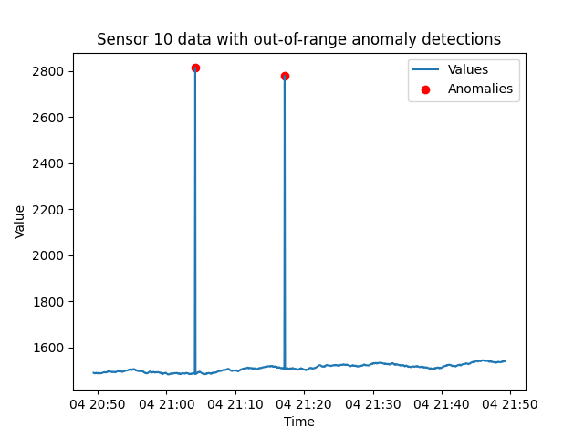

# Out-of-range anomalies

#### Checks the incoming data and tests to see if the values are within a 'valid' range. 

[Endpoint documentation](https://api.tinybird.co/endpoint/t_89b4aa3c33d24e82b599e69a1e73a421?token=p.eyJ1IjogIjJjOGIyYzQ2LTU4NzYtNGU5Mi1iNGJkLWMwNTliZDFhNzUwZSIsICJpZCI6ICJiMjM5ZGZmMC01YjdjLTQzNTQtOWY3MC1jMGIzZTE2M2VlNGYiLCAiaG9zdCI6ICJldV9zaGFyZWQifQ.-nNRyprUmEpK0tvElyljtfWCcyjW351dw17Z_FiaclQ)

**Query parameters:**
* **sensor_id** - Used to select a single sensor of interest. Otherwise, returns results for all sensors. 
* **detection_window_seconds** - Examine this many seconds of the most recent data history.
* **min_value** - Minimum threshold, readings less than this number will be detected as anomalies.
* **max_value** - Maximum threshold, readings greater than this number will be detected as anomalies.

## Introduction

Establishing threshold limits helps identify abnormal sensor readings. If a sensor reports a value outside of a valid range defined by minimum and maximum values. This method is effective for detecting sudden spikes or drops in data that may indicate a malfunction or abnormal conditions. This recipe can also be used to test latitude and longitude values and implement a 'bounding box' for validating location data. 

This example query illustrates how this simple recipe works: 

```sql
SELECT * 
FROM incoming_data
WHERE value < min_value 
OR value > max_value
```

## `out_of_range` Pipe and Endpoint

The `out_of_range` Pipe consists of a single Node: 
* `endpoint`

The `out_of_range` API Endpoint is designed to be flexible by supporting the following API Endpoint query parameters:
* **sensor_id** - Used to select a single sensor of interest.
* **detect_window_seconds** - Defines the time window (in seconds) for selecting data points to examine for anomalies. If polling on an interval, this can be set to match that interval to minimize duplicate detections.
* **min_value** - Sensor reports less than this are marked as an anomaly. 
* **max_value** - Sensor reports more than this are marked as an anomaly. 

### `endpoint` Node

This Node implements the `min_value`, `max_value`, `sensor_id`, and the `detect_window_seconds` query parameters. 

```sql
%




SELECT id, timestamp, value, 
   {{Int16(min_value, _min_value_default, description="Integer. Minimum threshold, readings less than this number will be detected as anomalies.",required=False)}} as min_value, 
   {{Int16(max_value, _max_value_default, description="Integer. Maximum threshold, readings greater than this number will be detected as anomalies.",required=False)}} as max_value 
FROM incoming_data
WHERE value < min_value OR value > max_value
               
  AND id = {{ Int32(sensor_id, description="Used to select a single sensor of interest. Optional.")}}       
    
AND timestamp > NOW() - INTERVAL {{Int16(detect_window_seconds, _detect_window_seconds_default, description="Search this many most recent minutes of the data history.")}} SECONDS
ORDER BY timestamp DESC
```

## Detection example

Here is an example of detecting this type of anomaly:



