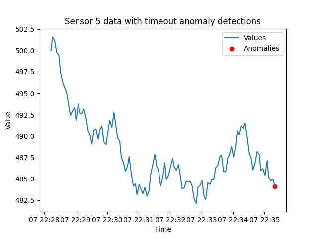

# Timeout anomalies

#### Checks the most recent report from each sensor and tests to see if it is reporting on its expected interval.

[Endpoint documentation](https://api.tinybird.co/endpoint/t_f803a2aa360f486cb885333eaf93b016?token=p.eyJ1IjogIjJjOGIyYzQ2LTU4NzYtNGU5Mi1iNGJkLWMwNTliZDFhNzUwZSIsICJpZCI6ICJiZjYwZTgyZi1iNWFjLTRjMzgtODJkZS1iYzhjMmNiNTY4YWUiLCAiaG9zdCI6ICJldV9zaGFyZWQifQ.rXUC9lNg6Q4QKcbHL_OS73scKSuGzG6uCXG9qwBq8_s)

**Query parameters:**

* **sensor_id** - Used to select a single sensor of interest. Otherwise, returns results for all sensors.. 
* **seconds** - If a sensor has not reported in the specified aboout of seconds, it is considered 'timedout'. Defaults to 30.

## Introduction

Knowing when a sensor has last reported is a fundamental detail of interest across most use cases. Having these data makes it possible to develop detections of when a sensor has stopped reporting. Sensors typically have some frequency they are expected to report on. Many sensor networks, such as ones that support manufacturing and vehicle monitoring, emit events many times a second. When a sensor has not reported in a few seconds, it is an anomaly of interest. Weather networks typically report in on some 'heartbeat' interval to confirm their connectivity when what it measures is absent, as with rain gauges. So, even on a sunny day, rain gauges send an event at least once a day. As with other IoT networks, the expected report frequency is commonly on the order of minutes and hours. 

The 'recipe' for detecting timeouts starts with looking up the **most recent** reports for each sensor of interest. 

## Selecting more recent reports

The following query selects for the most recent report from every sensor. It relies on the ClickHouse-provided `LIMIT # BY field` statement. 

```sql

SELECT * 
FROM incoming_data
ORDER BY timestamp DESC
LIMIT 1 BY id

```

Once the most recent events have been compiled, the next step is to test for sensors that have not reported in their expected interval. 

Here is some example SQL for testing the latency of event times. It selects sensors that have not reported within 30 seconds. 

```sql
SELECT * 
FROM get_most_recent
WHERE timestamp < NOW() - INTERVAL 30 SECONDS
```

This query returns any sensors that have 'timedout.' 

## `timeout` Pipe and Endpoint

The `timeout` Pipe consists of two Nodes:
  * `get_most_recent` 
  * `endpoint` 

### `get_most_recent` Node

As the name indicates, this Node selects the *most recent* report from every sensor. 

```sql
 SELECT id, 
   timestamp, 
   value
 FROM incoming_data
 ORDER BY timestamp DESC 
 LIMIT 1 BY id
```

### `endpoint` Node

This Node introduces query parameters for requesting data for a specific sensor and setting the timeout interval in seconds. 

```sql
%
SELECT * FROM get_most_recent
WHERE timestamp < NOW() - INTERVAL {{Int16(seconds,30,description="If a sensor has not reported in the specified aboout of seconds, it is considered 'timedout'.")}} SECONDS
                  
      AND id = {{ Int32(sensor_id, description="Used to select a single sensor of interest. Optional.")}} 
     
```


## Detection example

Below is an example of detecting this type of anomaly. Here the 'timeout' is set to thirty seconds. When called, this endpoint confirms sensors have reported within this many seconds. 

`https://api.tinybird.co/v0/pipes/timeout.json?sensor_id=1&seconds=30`




## Introduction to ClickHouse time windows 

While we are working with the concept of looking up the most recent data for a set of sensors, let's take this opportunity to start introducing [ClickHouse windows functions](https://clickhouse.com/docs/en/sql-reference/window-functions). 

The `timeout` method requies us to look up the single, most recent event for each sensor. Here is an alternative to the one above:

```sql

WITH RankedData AS (
    SELECT
        id,
        timestamp,
        value,
        ROW_NUMBER() OVER (PARTITION BY id ORDER BY timestamp DESC) AS row_num
    FROM
        incoming_data
)
SELECT
    id,
    timestamp,
    value
FROM
    RankedData
WHERE
    row_num = 1

```

Here we use the `ROW_NUMBER()` window function to assign a row number to each row within a partition defined by the id, ordering the rows by timestamp in descending order. This effectively ranks the rows for each id based on the timestamp, with the most recent timestamp receiving the row number 1.

The main query filters the rows based on the condition `row_num = 1`, selecting only the rows where the row number is equal to 1. This ensures that only the latest record for each id is included in the result set.

We will revisit ClickHouse window functions when we discuss  [**rate-of-change** anomaly detection](rate-of-change.md). 


