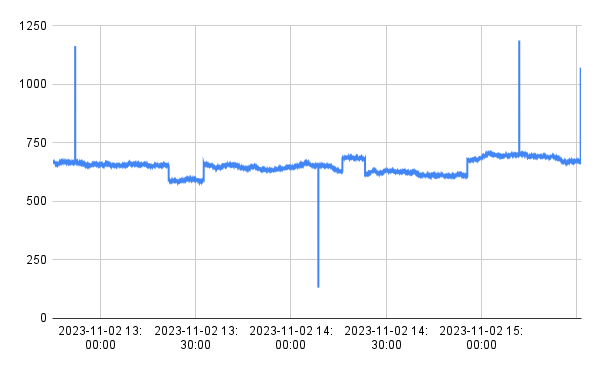
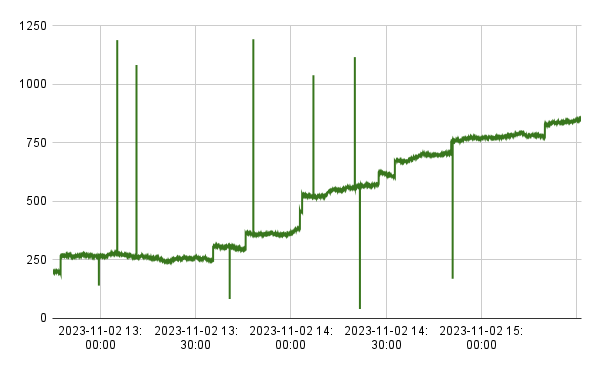
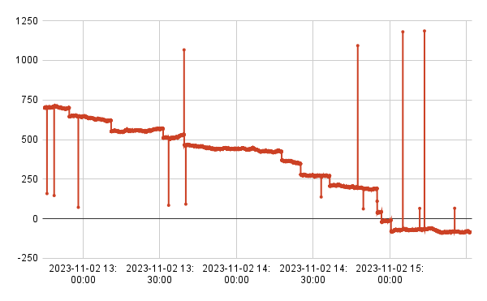

# Data generation 

The anaomaly detection recipes were developed with data generated with the `anomay-dataset-live.py` script. This script generates a set of sensors and starts emitting high frequency 'reports' from them. 

The generated time-series data can be prescribed with different types of anomalous data, including out-of-range reports, step functions that can produce rate-of-change outliers, and timeouts.

Sensor data patterns can also be prescribed with a *trend* setting of either 'up' or 'down'. 

For this project, recipes were developed on a set of 10 sensors that emit a report approximately every second. With these settings, this script emits 1.8M reports per day. 

This script posts reports to Tinybird using the [Events API](https://www.tinybird.co/docs/api-reference/events-api). 

This script was written with Python 3.11. By default the script looks for its configuration file (`settings.yaml`) in its root folder. 

## Configuring the data generator

The `settings.yaml` file is used to configure data generation details. 

Parameters in this file are used to set things such as:

* The number of sensors emitting data values. 
* The amount of seconds to wait between generating a new set of sensor values. 
* How many reports to batch into a single Events API post request.
* A range for initializing sensors. Note that the script will attempt to retrieve previous values from a `most_recent` endpoint before initiating it.
* The percentage of out-of-bounds readings along with minimum and maximum thresholds. 
* The maximum amount of change between subsequent reports for 'normal' changes. 
* The percentage of times a sensor experiences a 'non-normal' *step function* between reports, and a range for these step functions. 
* Sensors can also be configured to have a 'up' (rising) or 'down' (falling) trend. See below for examples of these. 
* Note that the script is hardcoded to timeout a specific sensor (sensor id 5). This type of anomaly should be configurable.
  
Here is an example of a `settings.yaml` file:
```
num_sensors: 10
post_batch_size: 20
sleep_seconds: 1       #How long to pause between sensor value updates... 
num_iterations: 1000000

id_init_min: 300
id_init_max: 1500

valid_min: 100
valid_max: 2000
percent_out_of_bounds: 0.03
percent_out_of_bounds_high: 100

value_max: 3000
value_min: 0
value_max_normal_change: 2

step_min: 20
step_max: 50
percent_step: 0.05
percent_step_trend: 0.06

sensor_overrides:
    - id: 1
      trend: null
      initial_value: 1000
      outliers: True
    - id: 2
      trend: 'up'
      initial_value: 600
      outliers: False
    - id: 3
      trend: 'down'
      initial_value: 1950  
      outliers: False
```

If this POC evolves, these two scripts could share common "generate data with anomalies" code. 


### Trend types

Sensors can be seeded with a *trend* setting. 

#### No trend



#### Trend up



#### Trend down




