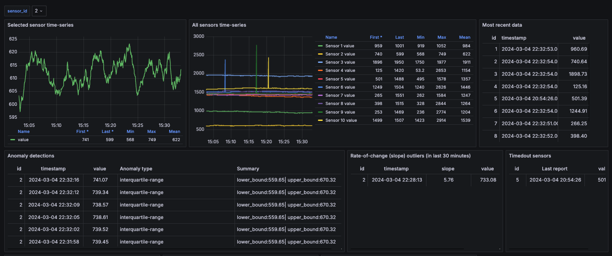

## Anomaly detection 

This project is a collection of things in support of demonstrating how Tinybird can be used to detect anomalies and support anomaly-detection systems. 

The main pieces of this project are:
* A data generator that emits time-series data with outliers and anomalies.
* A Tinybird Data Project with Pipes that implement different recipes to detect outliers and anomalies.
* A Grafana dashboard that displays the time-series data along with anomaly detection summaries. 

## Anomaly types
This project includes Tinybird Pipe 'recipes' that implement the following methods for detecting anomalies: 

* **Out-of-range**: Data that lies outside of a specified 'valid' range.
* **Rate-of-change**: Data with rates-of-change above a specified rate or slope.
* **Timeout**: Data that stops completely.
* Pattern changing. These methods develop data statistics to detect anomalies:
  * **Interquartile Range (IQR)**: Data outliers due to being outside of IQR lower and upper bounds.
  * **Z-score**: Data outliers due to its Z-Score.  

## Generating time-series data

For this project, a first step was building tools for generating time-series data with prescribed anomalies and outliers in it. These tools generate a time-series with the following features:
* Steady-state values with small random fluctuations.
* Random and isolated outliers that are outside of a "valid" range.  
* Step-functions where the data jumps upwards and downwards. Here the slope between points is an anomaly.
* Sensors that stop reporting.

### Data generation 

Kicking off the project with a set of data generator tools. These tools generate single-value time-series data for a set of sensors. Data from the sensors are emitted on a configured interval.

See the [the data-generator readme](./data-generator/readme.md) for more details.

### Trend types

Sensors can be seeded with a *trend* setting. 

#### No trend

#### Trend up

#### Trend down

