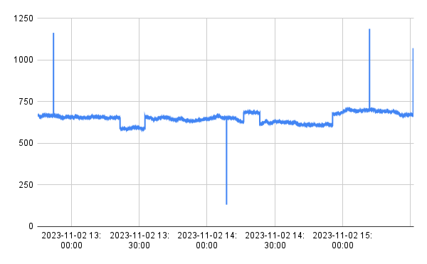

## Amonaly detection 

This repo is a collection of things in support of sowing how Tinybird can be used to support anomaly-detection systems. 

### Anomaly types

This tool generates time-series data with these outliers and anomalies: 

* Value outliers. Any value outside of a valid range. 
* Out-of-bounds slopes and Step functions, positive and negation. 
* Sensor data stopping.

### Data generation 

Kicking off the project with a set of data generator tools. Looking to demonstrate how to detect several types of anomalies, including:

This tool generates single-value time-series data for a set of sensors. Data from the sensor set is emitted on a configured interval.

### Trend types

Sensors can be seeded with a *trend* setting. 

