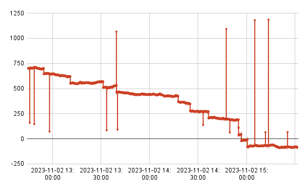

## Anomaly detection 

This repo is a collection of things in support of demonstrating how Tinybird can be used to support anomaly-detection systems. 

The first step is building some tools for generating time-series data with anomalies and outliers in it. The core of this tool will generate a time-series with the following features:
* Steady-state values with small random fluctuations.
* Random and isolated outliers that are outside of a "valid" range.  
* Step-functions where the data jumps upwards and downwards. Here the slope between points is an anomaly. 

### Anomaly types

This tool generates time-series data with these outliers and anomalies: 

* Value outliers. Any value outside of a valid range. 
* Out-of-bounds slopes and Step functions, positive and negation. 
* Sensor data stopping.

### Data generation 

Kicking off the project with a set of data generator tools. These tools generate single-value time-series data for a set of sensors. Data from the sensors are emitted on a configured interval.

See the [the data-generator readme](./data-generator/readme.md) for more details.

### Trend types

Sensors can be seeded with a *trend* setting. 

#### No trend

#### Trend up

#### Trend down

