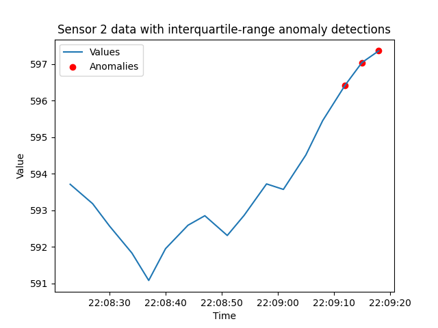

# Detect Interquartile Range anomalies with Tinybird

## Introduction
This tutorial illustrates how to detect Interquartile Range (IQR) anomalies with Tinybird. The IQR algorithm starts by calculating the first and third quartiles needed to develop a range of expected or acceptable values. These quartiles are determined over a specified number of minutes of most recent data. Separately, there is another time window used to select what data to scan for anomalies. 

By following the steps described below, you will be able to deploy an API endpoint for detecting IQR anomalies in your Tinybird data. 

After describing the API endpoint, the SQL patterns and syntax this 'recipe' is based on are introduced. You will see how they are implemented as a Tinybird Pipe that apply these queries in one or more Nodes. Then you'll see some example endpoint requests, followed by a discussion of the returned data and an example detection.

### What will you build? 

This tutorial will help you build an endpoint that detects sensors that IQR anomalies. 

The URL is: [api.tinybird.co/v0/pipes/iqr.json](https://ui.tinybird.co/endpoint/t_f803a2aa360f486cb885333eaf93b016?token=p.eyJ1IjogIjJjOGIyYzQ2LTU4NzYtNGU5Mi1iNGJkLWMwNTliZDFhNzUwZSIsICJpZCI6ICI3MWIxNGNmYi0xN2Q1LTQ4NDgtOTBiZC05NzZkN2M2N2M3YTAiLCAiaG9zdCI6ICJldV9zaGFyZWQifQ.wuq73n-fqZ7JJp9lceBMFkoPGc1nQuSYL9rV2p7zmdg)

The API endpoint supports these **query parameters**:
* **sensor_id** - Used to select a single sensor of interest. Otherwise, returns results for all sensors. 
* **detection_window_seconds** - Defines the time window (in seconds) for selecting data points to examine for anomalies.
* **stats_window_minutes** - Defines the time window (in minutes) for calculating first and third quartiles used to calculate IQR.
* **iqr_multiplier** - The multiplier of the IQR to set the range for testing for IQR anomalies.

## Understand Interquartile Range anomalies

The IQR method is a valuable tool for identifying anomalies in real-time data by providing a standardized way to compare individual data points to the overall trend of the data. This method is effective for identifying outliers and anomalies in sensor data. When a sensor reading is outside of an IQR-based range, it indicates a deviation from the expected behavior. 

The first step of the IQR algorithm is calculating the first and third quartiles (Q1 and Q3). These quartiles are based on a moving time window of recent data. 

The difference between these two quartiles is referred to as the IQR, as in:

IQR = Q3 - Q1

Data points that are below or above some level based on a multiplier of this IQR are considered outliers. Commonly, this multiple is set to `1.5`, so the equations look like:

* values < Q1 - (IQR * 1.5) 
* values > Q3 + (IQR * 1.5) 

This tutorial first introduces the SQL query techniques used in the interquartile range algorithm. It then provides Node syntax for building the `iqr` Pipe and explains the results returned from the endpoint.

## Design Interquartile Range anomaly detection logic with SQL

This recipe depends on a Common Table Expression (CTE) for generating statistical quartiles. The following query is an example CTE that calculates first (Q1) and third (Q3) quartiles and calculates a threshold for the last 30 minutes of sensor data. 

```sql
WITH stats AS (
    SELECT id,
        quantileExact(0.25) (value) AS lower_quartile,
        quantileExact(0.75) (value) AS upper_quartile,
        (upper_quartile - lower_quartile) * 1.5 AS IQR
    FROM incoming_data
    WHERE timestamp BETWEEN (NOW() - INTERVAL 30 MINUTE) AND NOW()
    GROUP BY id  
)
```

### Update queries with table and attribute names

The above SQL query is based on the following schema: 

* `timestamp` - DateTime. The UTC timestamp of when the event was created in the `YYYY-MM-DD HH:MM:SS` format.  
* `id` - Int16. The unique identifier of your sensors. Some sensor systems may need a larger integer range, or be a completely different data type, such as a unsigned integer, a floating type number or a string. 
* `value` - Float32. A numeric value being transmitted in the event payload.

You will likely need to update these references to match your own data schema and attribute names.

## Build an endpoint for detecting Interquartile Range anomalies 

The `iqr` Pipe consists of a single `endpoint` Node. 

### Prerequisites
* A Tinybird Workspace where you will add a new Pipe that applies the IQR algorithm. 

There are two general models for setting up this anomaly detection Pipe:
  * Add anomaly detection Pipe directly in the Workspace where the data being checked for anomalies resides. 
  * Create an anomaly-detection-specific Workspace and build the detection Pipe with a *shared* Data Source that resides in a separate Workspace. Data Sources can be shared by admin accounts. 

Next, follow these steps to create a single `endpoint` Node in an `iqr` Pipe. 

### Step 1: Create `iqr` Pipe. 
If you are new to Tinybird, learn more about Pipes and how to create them [HERE](https://www.tinybird.co/docs/concepts/pipes).

### Step 2: Create `endpoint` Node

The `endpoint` Node uses a Common Table Expression (CTE) to determine the first quartile (Q1) and the third quartile (Q3) for a time window of recent data based on the `stats_window_minutes` parameter. This Node also implements the query parameter for selecting a sensor id of interest.

The main query JOINs with the `stats` CTE and tests each event within the `detect_window_seconds` interval against the lower (`min_value`) and upper (`max_value`) bounds based on the IQR and the multiplier.

```sql
%
WITH
  {{ Int16(detect_window_seconds, 600, description="Search this many most recent seconds of the data history.") }} AS detect_window_seconds,
  stats AS (
  WITH 
    {{ Float32(iqr_multiplier, 1.5, description = "The multiplier of the IQR to set the range for testing for IQR anomalies.")}} AS iqr_multiplier,  
    {{ Int16(stats_window_minutes, 10, description="Defines the time window (in MINUTES) for calculating quartiles.") }} AS stats_window_minutes
  SELECT id,
     quantileExact(0.25) (value) AS lower_quartile,
     # quantileExact(0.5) (value) AS mid_quartile,  # Not needed.
     quantileExact(0.75) (value) AS upper_quartile,
     (upper_quartile - lower_quartile) * iqr_multiplier AS IQR,
     stats_window_minutes         
  FROM incoming_data
  WHERE timestamp BETWEEN (NOW() - INTERVAL stats_window_minutes MINUTE) AND NOW()
                   
      AND id = {{ Int32(sensor_id, description="Used to select a single sensor of interest. ")}}
        
  GROUP BY id
)
 SELECT DISTINCT timestamp, 
    id, 
    value, 
    ROUND(stats.IQR,2) AS IQR,       
    ROUND((stats.lower_quartile - stats.IQR),2) AS lower_bound, 
    ROUND((stats.upper_quartile + stats.IQR),2) AS upper_bound 
 FROM incoming_data
 JOIN stats ON incoming_data.id = stats.id
 WHERE timestamp BETWEEN NOW() - interval detect_window_seconds SECOND AND NOW()
 AND (value > (stats.upper_quartile + stats.IQR)
 OR value < (stats.lower_quartile - stats.IQR))
 ORDER BY timestamp DESC
```

### Algorithm implementation checklist
Here are the steps for building your own `iqr` detection endpoint:
- [ ] Create `iqr` Pipe.
- [ ] Update example SQL statements to match your schema.
- [ ] Create `endpoint` Node. 
- [ ] Publish the `endpoint` Node as an [API Endpoint](https://www.tinybird.co/docs/concepts/apis), which will provision your own `api.tinybird.co/v0/pipes/iqr.json` endpoint.
- [ ] Make test request. Copy or create an Auth Token with at least read permissions for the endpoint, and test the endpoint with a tool such as cURL, Postman, or any other HTTP client tool. Test a request such as `/pipes/iqr.json?sensor_id=1&detect_window_seconds=10&iqr_multiplier=1.5` and confirm you receive a successful `200` response.

## Example requests and working with returned data

Now that the endpoint is published, next are some example requests, an example response, and an example of an IQR anomaly being detected.

### Example requests
Here is an example request to return any sensor that has emitted data outside of its IQR, based on a 1.5 multiplier, in the last 10 minutes:

[/pipes/iqr.json?detect_window_seconds=600&iqr_multiplier=1.5](https://api.tinybird.co/v0/pipes/iqr.json?detect_window_seconds=600&iqr_multiplier=1.5&stats_window_minutes=10&token=p.eyJ1IjogIjJjOGIyYzQ2LTU4NzYtNGU5Mi1iNGJkLWMwNTliZDFhNzUwZSIsICJpZCI6ICI3MTE1M2UwMi1lYTI1LTQ0MjgtYjgyYy1kMmM4ZWIwYmIxZDQiLCAiaG9zdCI6ICJldV9zaGFyZWQifQ.Cfc7IZGnimlACIuHDYTLo0quGdEfuUn8VXUveTtyfYA)

If you want to check on a specific sensor, you can include the `sensor_id` parameter:

[/pipes/iqr.json?sensor_id=8&detect_window_seconds=10](https://api.tinybird.co/v0/pipes/iqr.json?detect_window_seconds=600&iqr_multiplier=1.5&stats_window_minutes=10&sensor_id=1&token=p.eyJ1IjogIjJjOGIyYzQ2LTU4NzYtNGU5Mi1iNGJkLWMwNTliZDFhNzUwZSIsICJpZCI6ICI3MTE1M2UwMi1lYTI1LTQ0MjgtYjgyYy1kMmM4ZWIwYmIxZDQiLCAiaG9zdCI6ICJldV9zaGFyZWQifQ.Cfc7IZGnimlACIuHDYTLo0quGdEfuUn8VXUveTtyfYA)

### Returned detection details
If any sensor reports data outside of its IQR, they will be listed in the "data" array of returned sensors. If this list is empty, all sensor data values are within the IQR. In this example response, sensors 4 and 8 have reported values outside of their IQR. 

```json
{
    "meta": [
        { "name": "timestamp", "type": "DateTime" },
        { "name": "id", "type": "Int16" },
        { "name": "value", "type": "Float32" },
        { "name": "IQR", "type": "Float64" },
        { "name": "lower_bound", "type": "Float64" },
        { "name": "upper_bound", "type": "Float64" }
    ],
    "data": [
        {
            "timestamp": "2024-04-04 20:18:56",
            "id": 10,
            "value": 1713.13,
            "IQR": 12.08,
            "lower_bound": 1713.5,
            "upper_bound": 1745.71
        },
        {
            "timestamp": "2024-04-04 20:16:38",
            "id": 7,
            "value": 1472.46,
            "IQR": 11.43,
            "lower_bound": 1479.06,
            "upper_bound": 1509.54
        }
    ],
    "rows": 2,
    "rows_before_limit_at_least": 22,
    "statistics": {
        "elapsed": 0.01341777,
        "rows_read": 24280,
        "bytes_read": 242800
    }
}
```
### Example detections

Below is an example of detecting this type of anomaly. Below is an example of detecting this type of anomaly. This plot displays a test time-series and shows with red spots when anomalies were detected.



## Conclusion

Detecting Interquartile Range (IQR) anomalies is important for detecting unexpected patterns in your time-series data. In this tutorial, a Tinybird `iqr` Pipe is built with a single Node that uses a CTE to generate the first and third quartiles (Q1 and Q3) needed to calculate the IQR, then flags events with values out of this range. 

The example Node syntax provided above provides the building blocks needed to build this IQR anomaly detection method.

## Next steps

* Learn about other anomaly detection algorithms:
  * [**Timeout**](./timeout.md)
  * [**Out-of-range**](./out-of-range.md)
  * [**Rate-of-change**](./rate_of_change.md)
  * [**Z-score**](./z-score.md)
  
* Learn more about Anomaly Detection and see example SQL: [Real-Time Anomaly Detection: Use Cases and Code Examples](https://www.tinybird.co/blog-posts/real-time-anomaly-detection)
* Learn more about building detection systems with Tinybird by reading the blog post that inspired this project: [Simple statistics for anomaly detection on time-series data](https://www.tinybird.co/blog-posts/anomaly-detection) that inspired this detection method. 