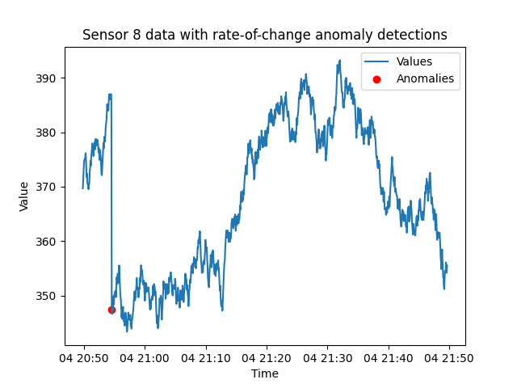
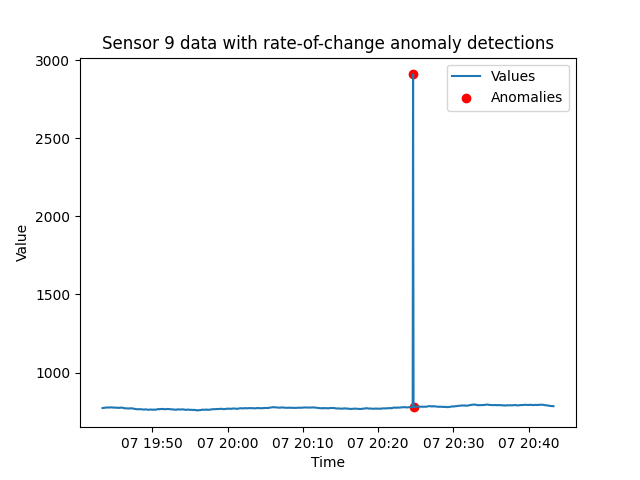

# Detect rate-of-change anomalies with Tinybird

## Introduction
This tutorial illustrates how to detect *rate-of-change* anomalies with Tinybird. Every time a sensor reports, the rate-of-change since its previous report is calculated and tested against a `max_slope` query parameter. The rate-of-change algorithm is simple in concept yet can depend on complex SQL statements to implement. For this tutorial, you will use a form of *window functions* to efficiently lookup up *previous* values.  

By following the steps described below, you will be able to deploy an API endpoint for detecting rate-of-change anomalies. 

After describing the API endpoint, there will be a review the SQL patterns and syntax this 'recipe' is based on. You will see how they are implemented as a Tinybird Pipe that apply these queries in one or more Nodes. Then you'll see some example endpoint requests, followed by a discussion of the returned data and an example detection.

### What will you build? 

This tutorial will help you build an endpoint that detects sensors with rate-of-change anomalies. 

The URL is: [api.tinybird.co/v0/pipes/rate_of_change.json](https://api.tinybird.co/v0/pipes/rate_of_change.json?detect_window_seconds=600&max_slope=3&token=p.eyJ1IjogIjJjOGIyYzQ2LTU4NzYtNGU5Mi1iNGJkLWMwNTliZDFhNzUwZSIsICJpZCI6ICI3MTE1M2UwMi1lYTI1LTQ0MjgtYjgyYy1kMmM4ZWIwYmIxZDQiLCAiaG9zdCI6ICJldV9zaGFyZWQifQ.Cfc7IZGnimlACIuHDYTLo0quGdEfuUn8VXUveTtyfYA)

The API endpoint supports these **query parameters**:
* **sensor_id** - Used to select a single sensor of interest. Otherwise, returns results for all sensors. 
* **detection_window_seconds** - Examine this many seconds of the most recent data history.
* **max_slope** - Maximum slope, any events with a rate-of-change higher than this are flagged as an anomaly.

See documentation [HERE](https://app.tinybird.co/eu_shared/endpoint/t_3ccf088f89624485a0da17bef01ec0ef?token=p.eyJ1IjogIjJjOGIyYzQ2LTU4NzYtNGU5Mi1iNGJkLWMwNTliZDFhNzUwZSIsICJpZCI6ICI3MTE1M2UwMi1lYTI1LTQ0MjgtYjgyYy1kMmM4ZWIwYmIxZDQiLCAiaG9zdCI6ICJldV9zaGFyZWQifQ.Cfc7IZGnimlACIuHDYTLo0quGdEfuUn8VXUveTtyfYA).

## Understand rate-of-change anomalies

Monitoring the rate of change in sensor readings is crucial for identifying abrupt changes across the sensor network. By setting 'acceptable' or 'expected limits on the slope of the data, you can detect instances where the rate of change is of interest. This is particularly useful for identifying gradual deteriorations or sudden disruptions.

To determine the slope, the previous report is retrieved and compared with the current report. The rate-of-change, or slope, is equal to the change in the y-values over the change in x-values.   

Knowing the current and previous values, slope is calculated as:

 `(value - previous_value) / (timestamp - previous_timestamp) AS slope`


This tutorial introduces the SQL query techniques used in this algorithm. It will then provide Node syntax for building the `rate_of_change` Pipe and explain the results returned from the endpoint.

## Design rate-of-change anomaly detection logic with SQL
The 'recipe' for detecting rate-of-change is based on looking up a sensor's previous value. While that seems like a simple task, when you are working with petabytes of data, doing it quickly can require specialized database features. 

### Select previous values 

This recipe is based on the use of the [ClickHouse `lagInFrame` function](https://clickhouse.com/docs/en/sql-reference/window-functions). This function is used to select the set of events *immediately before* the most recent event. This function allows you to access data from previous rows in your result set based on a specific ordering within partitions defined by the PARTITION BY clause. 

Here is how the `previous_timestamp` and `previous_value` values are retrieved:

```sql

lagInFrame(timestamp, 1) OVER 
(PARTITION BY id ORDER BY timestamp ASC ROWS BETWEEN 1 PRECEDING AND 1 PRECEDING) AS previous_timestamp, 

lagInFrame(value, 1) 
OVER (PARTITION BY id ORDER BY timestamp ASC ROWS BETWEEN 1 PRECEDING AND 1 PRECEDING) AS previous_value

```
These query statements surface the previous `timestamp` and `value` attributes within each partition defined by the `id`. Specifically, it retrieves the `timestamp` and `value` values from the row that precedes the current row by 1 position within each partition. The `ROWS BETWEEN 1 PRECEDING AND 1 PRECEDING` clause specifies the window frame over which the lag function operates. In this case, it is looking at the immediately preceding row. 

### Update queries with table and attribute names

The above SQL queries are based on the following schema: 

* `timestamp` - DateTime. The UTC timestamp of when the event was created in the `YYYY-MM-DD HH:MM:SS` format.  
* `id` - Int16. The unique identifier of your sensors. Some sensor systems may need a larger integer range, or be a completely different data type, such as a unsigned integer, a floating type number or a string. 
* `value` - Float32. A numeric value being transmitted in the event payload.

You will likely need to update these references to match your own data schema and attribute names.

## Build an endpoint for detecting rate-of-change anomalies 

The `rate_of_change` Pipe consists of two Nodes. The first `calculate_slope` Node selects the current and previous event values and calculates the *slope* or *rate-of-change* for each sensor. The second (and final) `endpoint` Node tests these rate-of-change results against the `max_slope` query parameter. 

### Prerequisites
* A Tinybird Workspace where you will add a new Pipe that applies the rate-of-change algorithm. 

There are two general models for setting up this anomaly detection Pipe:
  * Add anomaly detection Pipe directly in the Workspace where the data being checked for anomalies resides. 
  * Create an anomaly-detection-specific Workspace and build the detection Pipe with a *shared* Data Source that resides in a separate Workspace. Data Sources can be shared by admin accounts. 

Next, follow these steps to create the `calculate_slope` and `endpoint` Nodes in the `rate_of_change` Pipe. 

### Step 1: Create `rate_of_change` Pipe. 
If you are new to Tinybird, learn more about Pipes and how to create them [HERE](https://www.tinybird.co/docs/concepts/pipes).

### Step 2: Create `calculate_slope` Node

This Node uses the [ClickHouse `lagInFrame` function](https://clickhouse.com/docs/en/sql-reference/window-functions) to find the previous event timestamps and values. It calculate the rate-of-change based on the value difference divided by the time difference (`(value - previous_value) / (timestamp - previous_timestamp) AS slope`). 

```sql
%
WITH
  {{ Int16(detect_window_seconds, 600, description="Search this many most recent seconds of the data history.") }} AS detect_window_seconds,
  {{ Float32(max_slope, 3, description="Maximum slope, any higher than this are returned. Floating point")}} AS max_slope 
SELECT id, 
  timestamp, 
  previous_timestamp,
  (value - previous_value) / (timestamp - previous_timestamp) AS slope,
  value, 
  previous_value,
  (value - previous_value) AS value_diff,
  (timestamp - previous_timestamp) AS time_diff,
  max_slope,
  lagInFrame(timestamp, 1) OVER 
    (PARTITION BY id ORDER BY timestamp ASC ROWS BETWEEN 1 PRECEDING AND 1 PRECEDING) AS previous_timestamp, 
  lagInFrame(value, 1) OVER
    (PARTITION BY id ORDER BY timestamp ASC ROWS BETWEEN 1 PRECEDING AND 1 PRECEDING) AS previous_value
FROM incoming_data
WHERE timestamp > NOW() - INTERVAL detect_window_seconds SECOND
                 
    AND id = {{ Int32(sensor_id,description="Used to select a single sensor of interest. Otherwise, returns results for all sensors.")}}
      
ORDER BY timestamp DESC
```

### Step 3: Create `endpoint` Node

This Node tests the calculated slopes against the `max_slope` query parameter. Here the absolute value of the calculated slope is compared to the `max_slope`, so both negative and positive slopes are detected. 

```sql
SELECT id, 
  timestamp, 
  Round(slope,2) as slope, 
  Round(value_diff,2) as value_diff, 
  time_diff, 
  previous_value, 
  value, 
  max_slope 
FROM calculate_slope
WHERE ABS(slope) > max_slope
ORDER BY timestamp DESC
```

### Algorithm implementation checklist
Here are the steps for building your own rate-of-chane detection endpoint:
- [ ] Create `rate_of_change` Pipe (step 1). 
  - [ ] Update example SQL statements to match your schema.
- [ ] Create `calculate_slope` Node (step 2). 
- [ ] Create `endpoint` Node (step 3).
- [ ] Publish the `endpoint` Node as an [API Endpoint](https://www.tinybird.co/docs/concepts/apis), which will provision your own `api.tinybird.co/v0/pipes/rate_of_change.json` endpoint.
- [ ] Make test request. Copy or create an Auth Token with at least read permissions for the endpoint, and test the endpoint with a tool such as cURL, Postman, or any other HTTP client tool. Test a request such as `/pipes/rate_of_change.json?sensor_id=8&detect_window_seconds=10&max_slope=4` and confirm you receive a successful `200` response.


## Example requests and working with returned data

Now that the endpoint is published, next are some example requests, an example response, and an example of a rate-of-change anomaly being detected.

### Example requests
Here is an example request to return any sensor that has a rate-of-change greater than the `max_slope` of 3 over the last 10 minutes:

[/pipes/rate_of_change.json?detect_window_seconds=600&max_slope=3](https://api.tinybird.co/v0/pipes/rate_of_change.json?detect_window_seconds=600&max_slope=3&token=p.eyJ1IjogIjJjOGIyYzQ2LTU4NzYtNGU5Mi1iNGJkLWMwNTliZDFhNzUwZSIsICJpZCI6ICI3MTE1M2UwMi1lYTI1LTQ0MjgtYjgyYy1kMmM4ZWIwYmIxZDQiLCAiaG9zdCI6ICJldV9zaGFyZWQifQ.Cfc7IZGnimlACIuHDYTLo0quGdEfuUn8VXUveTtyfYA)

If you want to check on a specific sensor, you can include the `sensor_id` parameter:

[/pipes/rate_of_change.json?detect_window_seconds=600&max_slope=3&sensor_id=10](https://api.tinybird.co/v0/pipes/rate_of_change.json?detect_window_seconds=600&max_slope=3&token=p.eyJ1IjogIjJjOGIyYzQ2LTU4NzYtNGU5Mi1iNGJkLWMwNTliZDFhNzUwZSIsICJpZCI6ICI3MTE1M2UwMi1lYTI1LTQ0MjgtYjgyYy1kMmM4ZWIwYmIxZDQiLCAiaG9zdCI6ICJldV9zaGFyZWQifQ.Cfc7IZGnimlACIuHDYTLo0quGdEfuUn8VXUveTtyfYA)


### Returned detection details
If any sensors have a rate-of-change anomaly, they will be listed in the "data" array of returned sensors. If this list is empty, all sensors have a slope below the `max_slope` value. In this example response, the rate of change with sensor 10 has triggered two rate-of-change anomalies. In this particular example, the sensor was in a mostly steady-state mode of around 1,890, then emitted an outlier value of over 2,952. Here the maximum slope was exceeded when it jumped by over 1,000, and also when it dropped back to its steady-state.

```json
{
  "meta": [
    { "name": "id", "type": "Int16" },
    { "name": "timestamp", "type": "DateTime" },
    { "name": "slope", "type": "Float64" },
    { "name": "value_diff", "type": "Float64" },
    { "name": "time_diff", "type": "Int32" },
    { "name": "previous_value", "type": "Float32" },
    { "name": "value", "type": "Float32" },
    { "name": "max_slope", "type": "Float32" }
  ],
  "data": [
    {
      "id": 10,
      "timestamp": "2024-04-04 19:25:01",
      "slope": -531.77,
      "value_diff": -1063.53,
      "time_diff": 2,
      "previous_value": 2952.81,
      "value": 1889.28,
      "max_slope": 3
    },
    {
      "id": 10,
      "timestamp": "2024-04-04 19:24:59",
      "slope": 1065.51,
      "value_diff": 1065.51,
      "time_diff": 1,
      "previous_value": 1887.3,
      "value": 2952.81,
      "max_slope": 3
    }
  ],
  "rows": 2,
  "rows_before_limit_at_least": 2,
  "statistics": {
    "elapsed": 0.01021242,
    "rows_read": 5000,
    "bytes_read": 50000
  }
}
```
### Example detections

Here are two examples of detecting this type of anomaly. These plots display a test time-series and show with red spots when anomalies were detected.




## Conclusion

Rate-of-change anomaly detections are important for flagging when sensor values jump or drop more than an expected amount. In this tutorial, a Tinybird `rate_of_change` Pipe was built with a `calculate_slope` Node that uses a ClickHouse window function to retrieve sensor events that arrived immediately before the most recent report. Using the examples provided, you can build this rate-of-change anomaly detection method.

## Next steps

* Learn about other anomaly detection algorithms:
  * [**Timeout**](./timeout.md)
  * [**Out-of-range**](./out-of-range.md)
  * [**Interquartile Range (IQR)**](./iqr.md)
  * [**Z-score**](./z-score.md)
  
* Learn more about Anomaly Detection and see example SQL: [Real-Time Anomaly Detection: Use Cases and Code Examples](https://www.tinybird.co/blog-posts/real-time-anomaly-detection)
* Learn more about building detection systems with Tinybird by reading the blog post that inspired this project: [Simple statistics for anomaly detection on time-series data](https://www.tinybird.co/blog-posts/anomaly-detection) that inspired this detection method. 