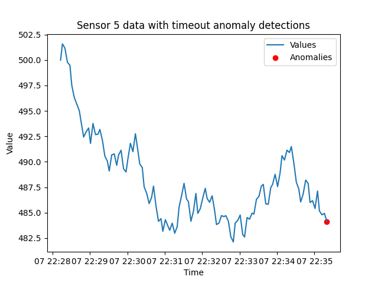

# Detect timeout anomalies with Tinybird

## Introduction
This tutorial illustrates how to detect sensor *timeout* anomalies with Tinybird. The timeout algorithm checks the most recent report from each sensor and tests to see if it is reporting on its expected interval. By following the steps described below, you will be able to deploy an API endpoint for detecting sensors that have not reported as expected. 

After describing the API endpoint, there will be a review the SQL patterns and syntax this 'recipe' is based on. You will see how they are implemented as a Tinybird Pipe that apply these queries in one or more Nodes. Then you'll see some example endpoint requests, followed by a discussion of the returned data and an example detection.

### What will you build? 

This tutorial will help you build an endpoint that detects sensors that have timed out. 

The URL is: [api.tinybird.co/v0/pipes/timeout.json](https://ui.tinybird.co/endpoint/t_f803a2aa360f486cb885333eaf93b016?token=p.eyJ1IjogIjJjOGIyYzQ2LTU4NzYtNGU5Mi1iNGJkLWMwNTliZDFhNzUwZSIsICJpZCI6ICI3MWIxNGNmYi0xN2Q1LTQ4NDgtOTBiZC05NzZkN2M2N2M3YTAiLCAiaG9zdCI6ICJldV9zaGFyZWQifQ.wuq73n-fqZ7JJp9lceBMFkoPGc1nQuSYL9rV2p7zmdg)

The API endpoint supports these **query parameters**:
* **sensor_id** - Used to select a single sensor of interest. Otherwise, returns results for all sensors. 
* **seconds** - If a sensor has not reported in the specified amount of seconds, it is considered 'timed out'. Defaults to 30 seconds.

## Understand timeout anomalies
Knowing when a sensor has stopped reporting is a fundamental anomaly of interest across most use cases. Sensors typically have some frequency they are expected to report on. Many sensor networks, such as ones that support manufacturing and vehicle monitoring, emit events many times a second. When a sensor has not reported in a few seconds, it is an anomaly of interest. Weather networks typically report in on some 'heartbeat' interval to confirm their connectivity when what it measures is absent, as with rain gauges. So, even on a sunny day, rain gauges typically send an event every hour to 'check-in'. As with other IoT networks, the expected report frequency is commonly on the order of minutes or hours. 

This tutorial first introduces the SQL query techniques used in the algorithm. It then provides Node syntax for building the `timeout` Pipe  and explains the results returned from the endpoint.

## Design timeout anomaly detection logic with SQL
The 'recipe' for detecting timeouts starts with looking up the **most recent** sensor reports. Once the most recent report times are retrieved, their timestamps are checked to see if they are within the *timeout* window. The window periods is some number of seconds long and the "end time" is the current time (UTC) of when the SQL query is made.

### Select and check most recent reports
The following query selects the most recent report from every sensor. It relies on the ClickHouse-provided [`LIMIT # BY field` statement](https://clickhouse.com/docs/en/sql-reference/statements/select/limit-by). 

```sql
SELECT * 
FROM incoming_data
ORDER BY timestamp DESC
LIMIT 1 BY id
```
After this query returns the most recent events, the next step is to test for sensors that have not reported in their expected interval. The following SQL query selects data from the previous query (`FROM get_most_recent`) and checks the 'last reported' timestamps against the timeout limit. Sensors that have not reported in 30 seconds are returned. 

```sql
SELECT * 
FROM get_most_recent
WHERE timestamp < NOW() - INTERVAL 30 SECONDS
```
This query returns any sensors that have 'timed out' by not reporting in the last 30 seconds. An endpoint built to detect timeouts needs to have a query parameter for setting the timeout interval. The next section implements an example endpoint that demonstrates this functionality.

### Update queries with table and attribute names

The above SQL queries are based on the following data schema: 

* `timestamp` - DateTime. The UTC timestamp of when the event was created in the `YYYY-MM-DD HH:MM:SS` format.  
* `id` - Int16. The unique identifier of your sensors. Some sensor systems may need a larger integer range, or be a completely different data type, such as a unsigned integer, a floating type number or a string. 
* `value` - Float32. A numeric value being transmitted in the event payload.

Be sure to update these queries to match your data schema metadata. You will likely need to update these references to match your own data schema and attribute names.


## Build an endpoint for detecting timeout anomalies 

The `timeout` Pipe consists of two Nodes. The first Node is named `get_most_recent`, and as the name implies, this Node applies the SQL shown above to look up when sensors last reported.  The second `endpoint` Node applies a `seconds` query parameter and selects sensors that have timed out. This Node also adds support for a `sensor_id` query parameter for selecting a specific sensor of interest. 

### Prerequisites
* A Tinybird Workspace where you will add a new Pipe that applies the timeout algorithm. 

There are two general models for setting up this anomaly detection Pipe:
  * Add anomaly detection Pipe directly in the Workspace where the data being checked for anomalies resides. 
  * Create an anomaly-detection-specific Workspace and build the detection Pipe with a *shared* Data Source that resides in a separate Workspace. Data Sources can be shared by admin accounts. 

Next, follow these steps to create the `get_most_recent` and `endpoint` Nodes in the `timeout` Pipe. 


### Step 1: Create `timeout` Pipe. 
If you are new to Tinybird, learn more about Pipes and how to create them [HERE](https://www.tinybird.co/docs/concepts/pipes).

### Step 2: Create `get_most_recent` Node

This Node selects the *most recent* report from every sensor. It is built with the ClickHouse `LIMIT 1 BY` clause, which supports looking up event timestamps at scale. It also adds support for the `seconds` query parameter, and defaults the timeout interval to 60 seconds. Note that the `seconds` value is added to the payload this query returns. A style adopted by this project is to compile and set up query parameters at the top of the first Node. By adding the `seconds` parameter value to the query results, it can be references in the next Node.

Note also that this query limits the period of recent data that is scanned for anomalies. This query focuses on anomalies that occurred within the past seven days.

```sql
 %
 WITH {{ Int16(seconds,60,description="If a sensor has not reported in the specified about of seconds, it is considered 'timed out'. Defaults to 60.")}} AS seconds
 SELECT id, 
  timestamp, 
  value,
  seconds
FROM incoming_data
WHERE timestamp > NOW() - INTERVAL 7 DAY
ORDER BY timestamp DESC
LIMIT 1 BY id
```

### Step 3: Create `endpoint` Node

This Node introduces query parameters for requesting data for a specific sensor and setting the timeout interval in seconds. 

```sql
%
SELECT id, timestamp, value, seconds 
FROM get_most_recent
WHERE timestamp < NOW() - INTERVAL seconds SECONDS
               
  AND id = {{ Int32(sensor_id, description="Used to select a single sensor of interest. Otherwise, returns results for all sensors.")}} 
  
```
### Algorithm implementation checklist
Here are the steps for building your own `timeout` detection endpoint:
- [ ] Create `timeout` Pipe.
- [ ] Update example SQL statements to match your schema.
- [ ] Create `most_most_recent` Node. 
- [ ] Create `endpoint` Node.
- [ ] Publish the `endpoint` Node as an [API Endpoint](https://www.tinybird.co/docs/concepts/apis), which will provision your own `api.tinybird.co/v0/pipes/timeout.json` endpoint.
- [ ] Make test request. Copy or create an Auth Token with at least read permissions for the endpoint, and test the endpoint with a tool such as cURL, Postman, or any other HTTP client tool. Test a request such as `/pipes/timeout.json?sensor_id=8&seconds=10` and confirm you receive a successful `200` response.

## Example requests and working with returned data

Now that the endpoint is published, next are some example requests, an example response, and an example of a timeout anomaly being detected.

### Example requests
Here is an example request to return any sensor that has not reported in 10 seconds:

[/pipes/timeout.json?seconds=10](https://api.tinybird.co/v0/pipes/timeout.json?seconds=10&token=p.eyJ1IjogIjJjOGIyYzQ2LTU4NzYtNGU5Mi1iNGJkLWMwNTliZDFhNzUwZSIsICJpZCI6ICI3MWIxNGNmYi0xN2Q1LTQ4NDgtOTBiZC05NzZkN2M2N2M3YTAiLCAiaG9zdCI6ICJldV9zaGFyZWQifQ.wuq73n-fqZ7JJp9lceBMFkoPGc1nQuSYL9rV2p7zmdg)

If you want to check on a specific sensor, you can include the `sensor_id` parameter:

[/pipes/timeout.json?sensor_id=8&seconds=10](https://api.tinybird.co/v0/pipes/timeout.json?seconds=10&token=p.eyJ1IjogIjJjOGIyYzQ2LTU4NzYtNGU5Mi1iNGJkLWMwNTliZDFhNzUwZSIsICJpZCI6ICI3MWIxNGNmYi0xN2Q1LTQ4NDgtOTBiZC05NzZkN2M2N2M3YTAiLCAiaG9zdCI6ICJldV9zaGFyZWQifQ.wuq73n-fqZ7JJp9lceBMFkoPGc1nQuSYL9rV2p7zmdg)


### Returned detection details
If any sensors have timed out, they will be listed in the "data" array of returned sensors. If this list is empty, no sensors have timed out. In this example response, a sensor with id = 5 has timed out and its most recent report time is included. 

```json
{
    "meta": [
        {"name": "id", "type": "Int16"},
        {"name": "timestamp","type": "DateTime"},
        {"name": "value", "type": "Float32"}
    ],
    "data": [
        {
            "id": 5,
            "timestamp": "2024-03-27 03:10:21",
            "value": 508.88
        }
    ],
    "rows": 1,
    "statistics": {
        "elapsed": 0.027658869,
        "rows_read": 802684,
        "bytes_read": 8026840
    }
}
```
### Example detections

Below is an example of detecting this type of anomaly. This plot displays a test time-series and shows with red spots when anomalies were detected.



## Conclusion

Sensor timeouts are a critical anomaly that any anomaly detection system should be able to identify. In this tutorial, a Tinybird `timeout` Pipe is build with two Nodes, one that returns the most recent reports, and another that examines their timestamps to determine if any have not reported within their expected interval. Using the examples provided, you can build this simple but important anomaly detection method.

## Next steps

* Learn about other anomaly detection algorithm:
  * [**Out-of-range**](./out-of-range.md)
  * [**Rate-of-change**](./rate-of-change.md)
  * [**Interquartile Range (IQR)**](./iqr.md)
  * [**Z-score**](./z-score.md)
  
* Learn more about Anomaly Detection and see example SQL: [Real-Time Anomaly Detection: Use Cases and Code Examples](https://www.tinybird.co/blog-posts/real-time-anomaly-detection)
* Learn more about building detection systems with Tinybird by reading the blog post that inspired this project: [Simple statistics for anomaly detection on time-series data](https://www.tinybird.co/blog-posts/anomaly-detection) that inspired this detection method. 