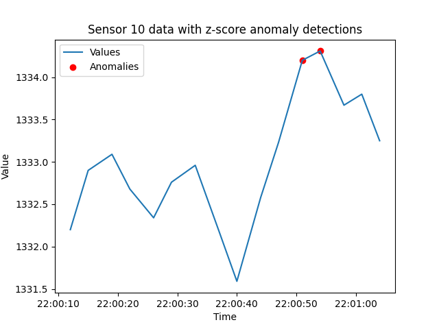

# Detect Z-score anomalies with Tinybird

## Introduction

This tutorial illustrates how to detect Z-score anomalies with Tinybird. 

By following the steps described below, you will be able to deploy an API endpoint for detecting Z-score anomalies. The Z-score algorithm starts by calculating the averages and standard deviations needed to develop a Z-score. These statistics are determined over a specified number of minutes of most recent data. These Z-scores are then tested against the `zscore_threshold` query parameter, where any report with a Z-score exceeding that threshold flagged as an anomaly. Separately, there is another time window used to select what data to scan for anomalies.

After describing the API endpoint, the SQL patterns and syntax this 'recipe' is based on are introduced. You will see how they are implemented as a Tinybird Pipe that apply these queries in one or more Nodes. Then you'll see some example endpoint requests, followed by a discussion of the returned data and an example detection.


### What will you build? 

This tutorial will help you build an endpoint that detects sensors that emit data that exceed a Z-score threshold used to identify anomalies. 

The URL is: [api.tinybird.co/v0/pipes/z_score.json](https://ui.tinybird.co/endpoint/t_f803a2aa360f486cb885333eaf93b016?token=p.eyJ1IjogIjJjOGIyYzQ2LTU4NzYtNGU5Mi1iNGJkLWMwNTliZDFhNzUwZSIsICJpZCI6ICI3MWIxNGNmYi0xN2Q1LTQ4NDgtOTBiZC05NzZkN2M2N2M3YTAiLCAiaG9zdCI6ICJldV9zaGFyZWQifQ.wuq73n-fqZ7JJp9lceBMFkoPGc1nQuSYL9rV2p7zmdg)

The API endpoint supports these **query parameters**:
* **sensor_id** - Used to select a single sensor of interest. Otherwise, returns results for all sensors. 
* **detection_window_seconds** - Defines the time window (in seconds) for selecting data points to examine for anomalies.
* **stats_window_minutes** - Defines the time window (in minutes) for calculating statistical averages and standard deviations needed to calculate a Z-score.
* **zscore_threshold** - The threshold for determining Z-score outliers, with scores higher than this detected as anomalies. Compared with absolute value of Z-score.

## Understand Z-score anomalies

This algorithm was inspired by [this Tinybird blog post about detecting anomalies with Z-scores](https://www.tinybird.co/blog-posts/anomaly-detection). 

Z-scores are a valuable tool for identifying anomalies in real-time data by providing a standardized way to compare individual data points to the overall trend of the data. When a sensor reading exceeds a certain Z-score threshold, it indicates a deviation from the expected behavior. This method is effective for identifying outliers and anomalies in sensor data.

Z-scores are based on data averages and standard deviations. These statistics are based on a moving time window of the recent data. 

For each new incoming data point, the Z-score is calculated using the formula:
Z-score = (value - average) / stddev
where:

* `value` is the data point being evaluated. 
* `average` is the average of the data within the chosen time window.
* `stddev` is the standard deviation of the data within the same window.

This tutorial first introduces the SQL query techniques used in the Z-score range algorithm. It then provides Node syntax for building the `z_score` Pipe and explains the results returned from the endpoint.

## Design Z-score anomaly detection logic with SQL

The Z-score algorithm starts by calculating the averages and standard deviations needed to develop a Z-score. These Z-scores are then compared with the `zscore_threshold` query parameter. Separately, there is another time window used to select what data to scan for anomalies.

This recipe is based on a Common Table Expression (CTE) for generating statistical averages and standard deviations. The following query is an example CTE that calculates the average and standard deviation for the last 30 minutes of sensor data. 

```sql
WITH stats AS (
    SELECT id,
        avg(value) AS average,
        stddevPop(value) AS stddev
    FROM incoming_data
    WHERE timestamp BETWEEN (NOW() - INTERVAL 30 MINUTE) AND NOW()
    GROUP BY id  
)
```

With this set up, the following query can reference the `stats` result set. 

In our production Pipe, this query is updated to support filtering by sensor id and setting the duration of the *statistics* window. See the `Interquartile Range` recipe for another example CTE.

### Update queries with table and attribute names

The above SQL queries are based on the following schema: 

* `timestamp` - DateTime. The UTC timestamp of when the event was created in the `YYYY-MM-DD HH:MM:SS` format.  
* `id` - Int16. The unique identifier of your sensors. Some sensor systems may need a larger integer range, or be a completely different data type, such as a unsighed integer, a floating type number or a string. 
* `value` - Float32. A numeric value being transmited in the event payload.

You will likely need to update these references to match your own data schema and attribute names.

## Build an endpoint for detecting Z-score anomalies 

The `z_score` Pipe consists of two Nodes. 

### Prerequisites
* A Tinybird Workspace where you will add a new Pipe that applies the Z-score algorithm. 

There are two general models for setting up this anomaly detection Pipe:
  * Add anomaly detection Pipe directly in the Workspace where the data being checked for anomalies resides. 
  * Create an anomaly-detection-specific Workspace and build the detection Pipe with a *shared* Data Source that resides in a separate Workspace. Data Sources can be shared by admin accounts. 

Next, follow these steps to create the `calculate_z_score` and `endpoint` Nodes in the `z_score` Pipe. 

#### Step 1: Create `z_score` Pipe.
If you are new to Tinybird, learn more about Pipes and how to create them [HERE](https://www.tinybird.co/docs/concepts/pipes).

#### Step 2: Create `calculate_z_score` Node as the first Node in the `z_score` Pipe.

In this Node a Common Table Expression (CTE) is set up that calculates the average and standard deviation for each sensor (id) within the specified `stats_window_minutes`.
* It filters incoming data based on the specified time window `(NOW() - INTERVAL stats_window_minutes MINUTE)` and optionally filters by sensor_id if provided.
* avg(value) calculates the average value for each id within the window.
* stddevPop(value) calculates the population standard deviation for each id within the window.
* The results are grouped by id and stored in the stats table.

The main query:
*  calculates z-scores for incoming data and identifies potential anomalies.
* It joins the incoming_data table (i) with the stats table (s) on the id column.
* It filters the incoming data based on the specified detect_window_seconds `(NOW() - interval detect_window_seconds) SECOND`.
* For each data point, it calculates the Z-score using the formula: (i.value - stats.average) / stats.stddev.
* It selects various columns, including the timestamp, sensor ID, value, calculated z-score, average, standard deviation, and the defined z-score multiplier.
* Finally, it orders the results by timestamp in descending order, displaying the most recent data points first.
```sql
%
WITH 
{{ Float32(zscore_threshold, 2, description="Floating point number. The threshold for determining Z-score outliers, with scores higher than this detected as anomalies. Compared with absolute value of Z-score.")}} AS zscore_threshold,
{{ Int32(detect_window_seconds, 600, description="Defines the time window (in SECONDS) for selecting data points to examine for anomalies. If polling on an interval, this can be set to match that interval to minimize duplicate detections.")}}  AS detect_window_seconds,
stats AS (
  WITH  {{ Int16(stats_window_minutes, 10, description="Defines the time window (in MINUTES) for calculating data averages and standard deviations used to calculate Z-score")}} AS stats_window_minutes    
  SELECT id,
        avg(value) AS average,
        stddevPop(value) AS stddev
    FROM incoming_data
    WHERE timestamp BETWEEN (NOW() - INTERVAL stats_window_minutes MINUTE) AND NOW()
                      
          AND id = {{ Int32(sensor_id, description="Used to select a single sensor of interest. Optional.")}}       
         
    GROUP BY id  
)
SELECT i.timestamp, 
     i.id, 
     i.value, 
     (i.value - stats.average)/stats.stddev AS zscore,
     stats.average,
     stats.stddev,
     zscore_threshold
FROM incoming_data i
JOIN stats s ON s.id = i.id
WHERE timestamp BETWEEN NOW() - INTERVAL detect_window_seconds SECOND AND NOW()
ORDER BY timestamp DESC
```

* This query calculates real-time z-scores by using a sliding window approach for both statistical calculations and data selection.
* The zscore_multiplier provides a threshold for identifying potential anomalies. If the absolute value of the z-score is greater than or equal to the multiplier, the data point might be considered an anomaly.
* The query can be customized by adjusting the default values for windows, the z-score multiplier, and potential filtering based on sensor_id.

#### Step 3: Create `endpoint` Node as the second Node in the `z_score` Pipe.

This query builds upon the previous `calculate_z_score` query, selecting and processing specific data points based on their Z-scores. This query demonstrates applying 'high', 'low' or 'OK' labels depending on the Z-scores. 

This query:
* Takes the pre-calculated z-scores from the calculate_z_score table.
* Rounds the z-score, average, and standard deviation for better presentation.
* Uses the multiIf function to categorize data points as 'low', 'high', or 'ok' based on their z-score deviation from the average.
* Filters the results to only include data points with significant deviations (either positive or negative) exceeding the defined zscore_multiplier threshold.
* Orders the results by timestamp, highlighting the most recent potential anomalies.


```sql
%
SELECT timestamp,
   id,
   value,
   Round(zscore,2) AS zscore,
   multiIf(zscore < (-1 * zscore_threshold), 'low', zscore > zscore_threshold, 'high','ok') AS test,
   ROUND(average,2) AS average,
   ROUND(stddev,2) AS stddev,
   zscore_threshold
FROM calculate_z_score
WHERE test = 'low' OR test = 'high' 
AND zscore < -1 * zscore_threshold OR zscore > zscore_threshold 
ORDER by timestamp DESC
```

### Algorithm implementation checklist
Here are the steps for building your own Z-score detection endpoint:
- [ ] Create `z_score` Pipe.
- [ ] Update example SQL statements to match your schema.
- [ ] Create `calculate_z_score` Node. 
- [ ] Create 'endpoint' Node.
- [ ] Publish the `endpoint` Node as an [API Endpoint](https://www.tinybird.co/docs/concepts/apis), which will provision your own `api.tinybird.co/v0/pipes/z_score.json` endpoint.
- [ ] Make test request. Copy or create an Auth Token with at least read permissions for the endpoint, and test the endpoint with a tool such as cURL, Postman, or any other HTTP client tool. Test a request such as `/pipes/z_score.json?sensor_id=8&detect_window_seconds=10&zscore_threshold=2` and confirm you receive a successful `200` response.


## Example requests and working with returned data

Now that the endpoint is published, next are some example requests, an example response, and an example of an IQR anomaly being detected. 

### Example requests
Here is an example request to return any sensor that emits a data value with a Z-score higher than the `zscore_threshold` query parameter:

[/pipes/z_score.json?detect_window_seconds=10]()

If you want to check on a specific sensor, you can include the `sensor_id` parameter:

[/pipes/z_score.json?sensor_id=8&detect_window_seconds=10]()

### Returned detection details
If any sensors report data that exceeds the Z-score threshold, they will be listed in the "data" array of returned sensors. If this list is empty, no sensor data have exceeded the Z-score threshold. In this example response, sensor id 3 has reported a value with a Z-score above the specified threshold. 

```json
{
{
  "meta": [
    { "name": "timestamp", "type": "DateTime" },
    { "name": "id", "type": "Int16" },
    { "name": "value", "type": "Float32" },
    { "name": "zscore", "type": "Float64" },
    { "name": "test", "type": "String" },
    { "name": "average", "type": "Float64" },
    { "name": "stddev", "type": "Float32" },
    { "name": "zscore_threshold", "type": "Float32" }
  ],
  "data": [
    {
      "timestamp": "2024-04-04 20:03:57",
      "id": 2,
      "value": 2510.91,
      "zscore": 2.08,
      "test": "high",
      "average": 2489.99,
      "stddev": 10.07,
      "zscore_threshold": 2
    } ],
  "rows": 1,
  "rows_before_limit_at_least": 63,
  "statistics": {
    "elapsed": 0.041288361,
    "rows_read": 20640,
    "bytes_read": 206400
  }
}
```

### Example detections

Below is an example of detecting this type of anomaly. This plot displays a test time-series and shows with red spots when anomalies were detected.



## Conclusion

Detecting Z-score anomalies is important for detecting unexpected *patterns* in your time-series data. In this tutorial, a Tinybird `z_score` Pipe is built with a `calculate_z_score` Node that uses a CTE to generate the data averages and standard deviations needed to calculate Z-scores. 

Using the examples provided, you can build this Z-score anomaly detection method. 

## Next steps

* Learn about other anomaly detection algorithms:
  * [**Timeout**](./timeout.md)
  * [**Out-of-range**](./out-of-range.md)
  * [**Rate-of-change**](./rate_of_change.md)
  * [**Interquartile Range (IQR)**](./iqr.md)
  
* Learn more about Anomaly Detection and see example SQL: [Real-Time Anomaly Detection: Use Cases and Code Examples](https://www.tinybird.co/blog-posts/real-time-anomaly-detection)
* Learn more about testing Z-scores with Tinybird by reading the blog post that inspired this project: [Simple statistics for anomaly detection on time-series data](https://www.tinybird.co/blog-posts/anomaly-detection) that inspired this detection method. 