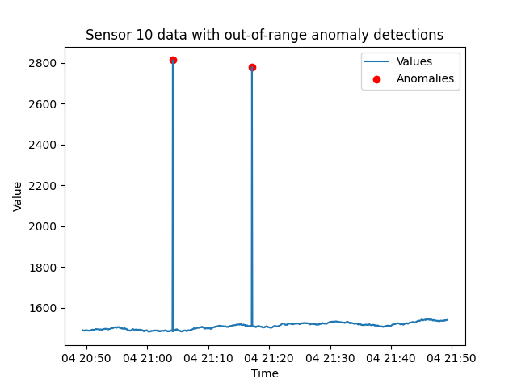

# Detect out-of-range anomalies with Tinybird

## Introduction
Checks the incoming data and tests to see if the values are within a 'valid' range. 

### What will you build? 

This tutorial will help you build an endpoint that detects sensor data that is outside of a specified range. With this endpoint, you can provide only a minimum allowable value, only a maximum allowable value, or both.  

The URL is: [api.tinybird.co/v0/pipes/out_of_range.json]()

The API endpoint supports these **query parameters**:
* **sensor_id** - Used to select a single sensor of interest. Otherwise, returns results for all sensors. 
* **detect_window_seconds** - Examine this many seconds of the most recent data history.
* **min_value** - Minimum threshold, readings less than this number will be detected as anomalies.
* **max_value** - Maximum threshold, readings greater than this number will be detected as anomalies.

## Understand out-of-range anomalies

Establishing threshold limits helps identify abnormal sensor readings. Most sensors emit data with an 'acceptable' range of values. If a sensor reports a value outside of a valid range defined by minimum and maximum values, it is flagged as an anomaly. This method is effective for detecting sudden spikes or drops in data that may indicate a malfunction or abnormal conditions. This recipe can also be used to test latitude and longitude values and implement a 'bounding box' for validating location data. 

This tutorial first introduces the SQL query techniques used in the algorithm. It then provides Node syntax for building the `out_of_range` Pipe and explains the results returned from the endpoint.

## Design out-of-range detection logic with SQL

This example query illustrates how this simple recipe works: 

```sql
SELECT * 
FROM incoming_data
WHERE value < min_value 
OR value > max_value
```
When it comes time to design the endpoint, logic will be added to support having just one min/max limit, and support for the `detect_window_seconds` and `sensor_id` query parameters will be provided. 

### Update queries with table and attribute names

The above SQL query is based on the following schema: 

* `timestamp` - DateTime. The UTC timestamp of when the event was created in the `YYYY-MM-DD HH:MM:SS` format.  
* `id` - Int16. The unique identifier of your sensors. Some sensor systems may need a larger integer range, or be a completely different data type, such as a unsigned integer, a floating type number or a string. 
* `value` - Float32. A numeric value being transmitted in the event payload.

You will likely need to update these references to match your own data schema and attribute names.

## Build an endpoint for detecting out-of-range anomalies 

The `out_of_range` Pipe consists of a single `endpoint` Node. 

### Prerequisites
* A Tinybird Workspace where you will add a new Pipe that applies the out-of-range algorithm. 

There are two general models for setting up this anomaly detection Pipe:
  * Add anomaly detection Pipe directly in the Workspace where the data being checked for anomalies resides. 
  * Create an anomaly-detection-specific Workspace and build the detection Pipe with a *shared* Data Source that resides in a separate Workspace. Data Sources can be shared by admin accounts. 

Next, follow these steps to create a single `endpoint` Node in an `out_of_range` Pipe. 

### Step 1: Create `out_of_range` Pipe. 
If you are new to Tinybird, learn more about Pipes and how to create them [HERE](https://www.tinybird.co/docs/concepts/pipes).

### Step 2: Create `endpoint` Node

This Node implements the `min_value`, `max_value`, `sensor_id`, and the `detect_window_seconds` query parameters. A style adopted by this project is to compile and set up query parameters at the top of the first Node. 

Note that as written, the following defaults are set. If these parameters are not included with the request, these defaults are used:
* The `detect_window_seconds` parameter defaults is set to 600 seconds (10 minutes).
* The `min_value` parameter defaults to 0. Any negative value is flagged as an anomaly.
* The `max_value` parameter defaults to 1,000,000.

The `min_value` and `max_values` defaults should be updated to match your sensor network and tuned to their accepted range.  The `detect_window_seconds` can be set to match your endpoint pulling interval. 

The `if defined()` function is used to see if the request includes the `min_value` and `max_value` query parameters. If present, the template language blends them into the query as needed. 

```sql
%
WITH
  {{ Int16(detect_window_seconds, 600, description="Search this many most recent seconds of the data history.") }} AS detect_window_seconds,
  {{ Int16(min_value, 0, description="Integer. Minimum threshold, readings less than this number will be detected as anomalies.", required=False) }} AS min_value,
  {{ Int32(max_value, 100000, description="Integer. Maximum threshold, readings greater than this number will be detected as anomalies.", required=False) }} AS max_value
SELECT id, timestamp, value
FROM incoming_data
WHERE 1

  
    AND value < min_value OR value > max_value
  
    AND value < min_value
  

    AND value > max_value

  {{ error('You must define at least one of min_value or max_value') }}

               
  AND id = {{ Int16(sensor_id, description="Used to select a single sensor of interest. Optional.")}}       
    
AND timestamp > NOW() - INTERVAL detect_window_seconds SECONDS
```

### Algorithm implementation checklist
Here are the steps for building your own `timeout` detection endpoint:
- [ ] Create `out_of_range` Pipe.
- [ ] Update example SQL statements to match your schema.
- [ ] Create `endpoint` Node. 
- [ ] Publish the `endpoint` Node as an [API Endpoint](https://www.tinybird.co/docs/concepts/apis), which will provision your own `api.tinybird.co/v0/pipes/out_of_range.json` endpoint.
- [ ] Make test request. Copy or create an Auth Token with at least read permissions for the endpoint, and test the endpoint with a tool such as cURL, Postman, or any other HTTP client tool. Test a request such as `/pipes/out_of_range.json?sensor_id=8&detect_window_seconds=60&min_value=0&max_value=100` and confirm you receive a successful `200` response.

## Example requests and working with returned data

Now that the endpoint is published, next are some example requests, an example response, and an example of a rate-of-change anomaly being detected.

### Example requests

Here is a request to return any sensor events that are outside of a 0-1000 range within the last 10 seconds:
[https://api.tinybird.co/v0/pipes/out_of_range.json?&detect_window_seconds=10&min_value=0&max_value=1000](https://api.tinybird.co/v0/pipes/out_of_range.json?detect_window_seconds=10&min_value&max_value=1000&token=p.eyJ1IjogIjJjOGIyYzQ2LTU4NzYtNGU5Mi1iNGJkLWMwNTliZDFhNzUwZSIsICJpZCI6ICJmZjg1OGUwZi02YzQ4LTQ0ZDktYjIyNi0yOTk4Mjg5MTYyMjkiLCAiaG9zdCI6ICJldV9zaGFyZWQifQ.DLN8EHoj0Zhb1ALi8qMbj-zywgQKcgEZyjiTND8pm1E)

If you want to check on a specific sensor, you can add the `sensor_id` parameter:
[/pipes/out_of_range.json?sensor_id=1&detect_window_seconds=10&min_value=0&max_value=1000](https://api.tinybird.co/v0/pipes/out_of_range.json?sensor_id=1&detect_window_seconds=10&max_value=1000&token=p.eyJ1IjogIjJjOGIyYzQ2LTU4NzYtNGU5Mi1iNGJkLWMwNTliZDFhNzUwZSIsICJpZCI6ICJmZjg1OGUwZi02YzQ4LTQ0ZDktYjIyNi0yOTk4Mjg5MTYyMjkiLCAiaG9zdCI6ICJldV9zaGFyZWQifQ.DLN8EHoj0Zhb1ALi8qMbj-zywgQKcgEZyjiTND8pm1E)

This request checks for any sensor with negative values. Here only the `min_value` parameter is included, and there is no limit set for the maximum 'acceptable' value:

https://api.tinybird.co/v0/pipes/out_of_range.json?&detect_window_seconds=60&min_value=0

### Returned detection details
If any sensors are reporting out-of-range values, they will be listed in the "data" array of returned sensors. If this list is empty, all sensors are within range. during the most recent `detect_window_seconds` period.  In this example response, sensors 1 and 4 have sent values outside of the expected range (0-1000 in this case) within a `detect_window_seconds` interval of 60 seconds. 

```json
{
    "meta": [
        {
            "name": "id",
            "type": "Int16"
        },
        {
            "name": "timestamp",
            "type": "DateTime"
        },
        {
            "name": "value",
            "type": "Float32"
        }
    ],
    "data": [
        {
            "id": 1,
            "timestamp": "2024-04-04 16:10:04",
            "value": 1103.01
        },
        {
            "id": 4,
            "timestamp": "2024-04-04 16:01:58",
            "value": 1113.81
        }
    ],
    "rows": 2,
    "statistics": {
        "elapsed": 0.004488401,
        "rows_read": 8900,
        "bytes_read": 89000
    }
}
```

### Example detections

Below is an example of detecting this type of anomaly. This plot displays a test time-series and shows with red spots when anomalies were detected.



## Conclusion

Sensors that are reporting outside of an 'acceptable' range are flagged as out-of-range anomalies. Out-of-range anomalies are a fundamental type anomaly detection system should be able to identify. In this tutorial, a Tinybird `out_of_range` Pipe is built with a single Node that compares incoming values against 'valid' range limits to determine if any sensors are reporting outside of their expected range. Using the example provided, you can build this simple but important anomaly detection method.

## Next steps
* Learn about other anomaly detection algorithm:
  * [**Timeout**](./timeout.md)
  * [**Rate-of-change**](./rate-of-change.md)
  * [**Interquartile Range (IQR)**](./iqr.md)
  * [**Z-score**](./z-score.md)
  
* Learn more about Anomaly Detection and see example SQL: [Real-Time Anomaly Detection: Use Cases and Code Examples](https://www.tinybird.co/blog-posts/real-time-anomaly-detection)
* Learn more about building detection systems with Tinybird by reading the blog post that inspired this project: [Simple statistics for anomaly detection on time-series data](https://www.tinybird.co/blog-posts/anomaly-detection) that inspired this detection method. 